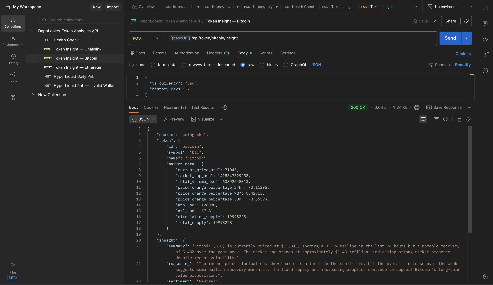
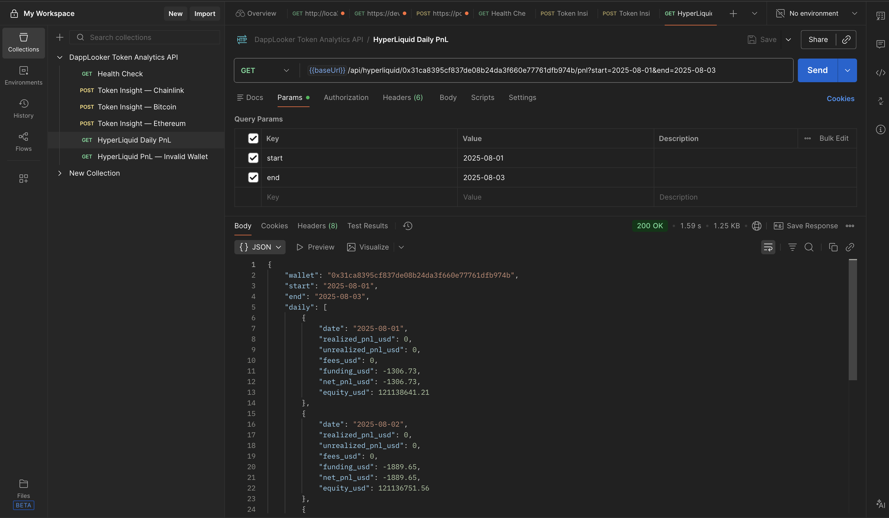

# DappLooker — Token Insight & Analytics API

A Node.js/Express backend that provides two REST APIs:

1. **Token Insight API** — Fetches token market data from CoinGecko, sends it to an AI model, and returns combined market data + AI-generated insight.
2. **HyperLiquid Daily PnL API** — Fetches a wallet's trade fills and funding from HyperLiquid and computes daily profit & loss breakdown.

---

## Quick Start

### Prerequisites

- **Node.js** >= 18
- An **OpenAI API key** (or any OpenAI-compatible endpoint)

### 1. Clone & Install

```bash
git clone <repo-url>
cd dapp_looker
npm install
```

### 2. Configure Environment

```bash
cp .env.example .env
# Edit .env and set your OPENAI_API_KEY
```

| Variable | Required | Default | Description |
|---|---|---|---|
| `PORT` | No | `3000` | Server port |
| `OPENAI_API_KEY` | **Yes** | — | OpenAI (or compatible) API key |
| `AI_MODEL` | No | `gpt-4o-mini` | Model name |
| `OPENAI_BASE_URL` | No | — | Override for local/custom AI endpoints |

**Using a local model (e.g. Ollama / llama.cpp):**

```bash
OPENAI_BASE_URL=http://localhost:11434/v1
AI_MODEL=llama3
```

### 3. Run

```bash
# Development (auto-reload)
npm run dev

# Production
npm start
```

Server starts at `http://localhost:3000`.

---

## Docker

```bash
docker build -t dapplooker-api .
docker run -p 3000:3000 --env-file .env dapplooker-api
```

---

## Screenshots

### Token Insight API (Bitcoin)



### HyperLiquid Daily PnL API



---

## API Reference

### Health Check

```
GET /health
```

Returns `{ "status": "ok", "timestamp": "..." }`.

---

### 1. Token Insight

```
POST /api/token/:id/insight
```

Fetches token data from CoinGecko, generates an AI insight, and returns both.

**Path params:**
- `id` — CoinGecko token ID (e.g. `bitcoin`, `ethereum`, `chainlink`)

**Request body (optional):**

```json
{
  "vs_currency": "usd",
  "history_days": 30
}
```

**Example response:**

```json
{
  "source": "coingecko",
  "token": {
    "id": "ethereum",
    "symbol": "eth",
    "name": "Ethereum",
    "market_data": {
      "current_price_usd": 2070.69,
      "market_cap_usd": 249222656429,
      "total_volume_usd": 27207944769,
      "price_change_percentage_24h": -3.22897,
      "price_change_percentage_7d": 1.8485,
      "price_change_percentage_30d": -10.0176,
      "ath_usd": 4946.05,
      "atl_usd": 0.432979,
      "circulating_supply": 120692108.975498,
      "total_supply": 120692108.975498
    }
  },
  "insight": {
    "summary": "Ethereum (ETH) is currently priced at $2070.69, reflecting a slight decline of 3.23% over the last 24 hours, while showing resilience with a 1.85% increase over the past week. Despite a notable 10.02% decrease in the last 30 days, the token remains a cornerstone of the decentralized application ecosystem.",
    "reasoning": "The recent price fluctuations suggest a market correction following a prior downtrend, but Ethereum's strong fundamentals in decentralized finance and smart contracts continue to support its value. The current price is significantly lower than its all-time high, indicating potential for recovery as market conditions improve.",
    "sentiment": "Neutral",
    "risk_level": "Medium",
    "key_factors": [
      "Current market volatility",
      "Strong DeFi ecosystem presence",
      "Recent price trends indicating potential recovery"
    ]
  },
  "model": {
    "provider": "openai",
    "model": "gpt-4o-mini"
  }
}
```

---

### 2. HyperLiquid Daily PnL

```
GET /api/hyperliquid/:wallet/pnl?start=YYYY-MM-DD&end=YYYY-MM-DD
```

Fetches trade fills and funding from HyperLiquid and computes daily PnL breakdown.

**Path params:**
- `wallet` — Ethereum address (42-char hex, e.g. `0x31ca8395...`)

**Query params:**
- `start` — Start date (YYYY-MM-DD)
- `end` — End date (YYYY-MM-DD)

**Example response:**

```json
{
  "wallet": "0x1e37a337ed460039d1b15bd3bc489de789768d5e",
  "start": "2025-08-01",
  "end": "2025-08-03",
  "daily": [
    {
      "date": "2025-08-01",
      "realized_pnl_usd": 0,
      "unrealized_pnl_usd": 0,
      "fees_usd": 0,
      "funding_usd": -171.51,
      "net_pnl_usd": -171.51,
      "equity_usd": 7193037.63
    },
    {
      "date": "2025-08-02",
      "realized_pnl_usd": 0,
      "unrealized_pnl_usd": 0,
      "fees_usd": 0,
      "funding_usd": -159.16,
      "net_pnl_usd": -159.16,
      "equity_usd": 7192878.47
    },
    {
      "date": "2025-08-03",
      "realized_pnl_usd": 0,
      "unrealized_pnl_usd": 0,
      "fees_usd": 0,
      "funding_usd": -154.1,
      "net_pnl_usd": -154.1,
      "equity_usd": 7192724.37
    }
  ],
  "summary": {
    "total_realized_usd": 0,
    "total_unrealized_usd": 0,
    "total_fees_usd": 0,
    "total_funding_usd": -484.77,
    "net_pnl_usd": -484.77
  },
  "diagnostics": {
    "data_source": "hyperliquid_api",
    "fills_count": 0,
    "funding_events_count": 60,
    "account_value_usd": 7193209.138448,
    "last_api_call": "2026-03-05T16:27:48.912Z",
    "notes": "Realized PnL from closed trades. Unrealized PnL requires historical mark prices not available via API; reported as 0 for historical dates."
  }
}
```

**Error handling:**
- `400` — Invalid wallet address, missing/invalid dates, start > end
- `404` — Token not found (Token API only)
- `500` — Internal / upstream API errors

---

## Testing

```bash
npm test
```

Runs unit tests for PnL calculation, AI prompt building, and route validation.

---

## Project Structure

```
src/
├── index.js              # Server entry point
├── app.js                # Express app setup
├── config.js             # Environment configuration
├── middleware/
│   └── errorHandler.js   # Global error handler
├── routes/
│   ├── token.js          # POST /api/token/:id/insight
│   └── hyperliquid.js    # GET /api/hyperliquid/:wallet/pnl
├── services/
│   ├── coingecko.js      # CoinGecko API client
│   ├── ai.js             # AI service (OpenAI-compatible)
│   └── hyperliquid.js    # HyperLiquid API client
└── utils/
    └── pnl.js            # PnL calculation logic
tests/
├── pnl.test.js           # PnL utility tests
├── ai.test.js            # AI service tests
└── routes.test.js        # Route integration tests
```

---

## Design Decisions

- **No database required** — all data is fetched from external APIs in real-time.
- **Unrealized PnL** — Historical mark prices are not available via HyperLiquid's public API, so unrealized PnL is reported as 0 for past dates. Current positions are fetched via `clearinghouseState` for diagnostics.
- **AI flexibility** — Supports OpenAI, local models (Ollama, llama.cpp), or any OpenAI-compatible endpoint via `OPENAI_BASE_URL`.
- **Pagination** — HyperLiquid fills are paginated in batches to handle wallets with high activity.

---

## Postman Collection

Import `postman_collection.json` into Postman. Set the `baseUrl` variable (defaults to `http://localhost:3000`).
